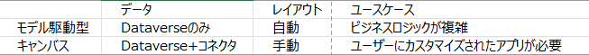
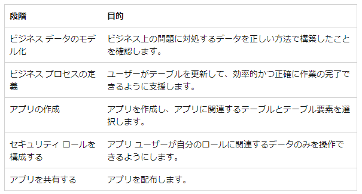

# Power Apps の機能を実装する(25~30%)
# 一般的な Power Apps コンポーネントを特定する

## [キャンバス アプリとモデル駆動型アプリの違いについて説明する](https://learn.microsoft.com/ja-jp/power-apps/guidance/planning/app-type)

## [数式のユース ケースについて説明する](https://learn.microsoft.com/ja-jp/power-platform/power-fx/overview)
### [excel からアプリを作成](https://learn.microsoft.com/ja-jp/power-apps/maker/canvas-apps/get-started-create-from-blank)で使用した数式の役割

- [SortByColumns](https://learn.microsoft.com/ja-jp/power-platform/power-fx/reference/function-sort)
- [Search](https://learn.microsoft.com/ja-jp/power-platform/power-fx/reference/function-filter-lookup)
- [If](https://learn.microsoft.com/ja-jp/power-platform/power-fx/reference/function-if)
- [Select](https://learn.microsoft.com/ja-jp/power-platform/power-fx/reference/function-select)
- [Refresh](https://learn.microsoft.com/ja-jp/power-platform/power-fx/reference/function-refresh)
- [NewForm](https://learn.microsoft.com/ja-jp/power-platform/power-fx/reference/function-form)
- [Navigate](https://learn.microsoft.com/ja-jp/power-platform/power-fx/reference/function-navigate#navigate)

### 参考
[キャンバスアプリの数式の使用を始める](https://learn.microsoft.com/ja-jp/power-apps/maker/canvas-apps/working-with-formulas)
[自然言語を Power Fx式に変換する](https://learn.microsoft.com/ja-jp/power-apps/maker/canvas-apps/power-apps-ideas-transform)
[例をPower Fx式に変換する](https://learn.microsoft.com/ja-jp/power-apps/maker/canvas-apps/power-apps-ideas-train-examples)

# 基本的なキャンバス アプリを構築する

## [データ ソースの種類を説明する](https://learn.microsoft.com/ja-jp/power-apps/maker/canvas-apps/working-with-data-sources)
### 接続されたデータソース
一般的なデータソースは、テーブルです。
データソースへの接続を使用すると多くの形式でデータの読み書きを行えます。
また、それらをクラウドサービスに格納できます。

テーブル以外のデータソースは
- 電子メール
- 予定表
- Twitter
- 通知
が含まれます。

また、テーブルの種類は以下の通りです。
- 内部テーブル: アプリのメモリにのみ存在。数式を使用して新しいテーブルを作成できる。
- 外部テーブル: データソースに格納。後で取得して共有できる。
### ローカルデータソース
事前に[データフォームについて](https://learn.microsoft.com/ja-jp/power-apps/maker/canvas-apps/working-with-forms)を読む必要がある
以下を使用してデータソースからデータを読み取り・書き込む
- Gallery
- Display
- Edit from 

## [コネクタを使用してデータ ソースに接続する](https://learn.microsoft.com/ja-jp/power-apps/maker/canvas-apps/connections-list#actions)

- データソースの接続
  手動で接続する。計算式を記述。

## データからアプリを作成する
[excel からアプリを作成](https://learn.microsoft.com/ja-jp/power-apps/maker/canvas-apps/get-started-create-from-blank)

## [コントロールを使用してユーザー エクスペリエンスを設計する]()

## [アプリを発行して共有する](https://learn.microsoft.com/ja-jp/power-apps/maker/canvas-apps/share-app)

## [Microsoft Teams への埋め込みについて説明する](https://learn.microsoft.com/ja-jp/power-apps/teams/embed-teams-app)

# 基本的なモデル駆動型アプリを構築する

## [テーブルからモデル駆動型アプリを作成する](https://learn.microsoft.com/ja-jp/power-apps/maker/model-driven-apps/build-first-model-driven-app)
[モデル駆動型アプリを構築する手順](https://learn.microsoft.com/ja-jp/power-apps/maker/model-driven-apps/app-building-steps)

## [フォームを変更する](https://learn.microsoft.com/ja-jp/power-apps/maker/model-driven-apps/create-and-edit-forms#edit-a-form)

## ビューと列を作成および変更する
- [ビューの作成](https://learn.microsoft.com/ja-jp/power-apps/maker/model-driven-apps/create-or-edit-model-driven-app-view#create-a-public-view-in-power-apps)
- [ビューの変更](https://learn.microsoft.com/ja-jp/power-apps/maker/model-driven-apps/create-or-edit-model-driven-app-view#edit-public-views-from-a-table)
- [列の作成・追加](https://learn.microsoft.com/ja-jp/power-apps/maker/model-driven-apps/choose-and-configure-columns#adding-columns)
- [列の変更](https://learn.microsoft.com/ja-jp/power-apps/maker/model-driven-apps/choose-and-configure-columns#changing-column-widths)

## [アプリを発行して共有する](https://learn.microsoft.com/ja-jp/power-apps/maker/model-driven-apps/share-model-driven-app)

