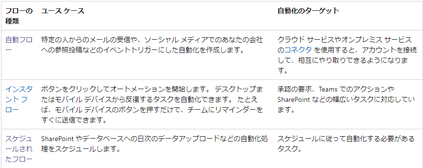

# 一般的な Power Automate コンポーネントを特定する
## [クラウド、デスクトップ、ビジネス プロセス フローを含むフローの種類を特定する](https://learn.microsoft.com/ja-jp/power-automate/flow-types)

### クラウドフロー
- [自動フロー](https://learn.microsoft.com/ja-jp/power-automate/get-started-logic-flow)
- [インスタントフロー](https://learn.microsoft.com/ja-jp/power-automate/introduction-to-button-flows)
- [スケジュールされたフロー](https://learn.microsoft.com/ja-jp/power-automate/run-scheduled-tasks)

### [デスクトップフロー](https://learn.microsoft.com/ja-jp/power-automate/desktop-flows/introduction)
Web またはデスクトップ上のタスクを自動化する。
### [ビジネスプロセスフロー](https://learn.microsoft.com/ja-jp/power-automate/business-process-flows-overview)

## [フローのユース ケースと使用可能なフロー テンプレートについて説明する](https://learn.microsoft.com/ja-jp/power-automate/overview-solution-flows)
### フローのユースケース
#### クラウドフロー

#### デスクトップフロー
- aaa
- bbb
- ccc
#### スケジュールされたフロー
- ddd
- eee
- fff

### [使用可能なフローテンプレート](https://powerautomate.microsoft.com/ja-jp/templates/)

## Power Automate でコネクタのトリガーとアクションがどのように使用されるかについて説明する
- [トリガー](https://learn.microsoft.com/ja-jp/power-automate/triggers-introduction)
- [アクション](https://learn.microsoft.com/ja-jp/power-automate/desktop-flows/actions-reference)  

## switch、do until、apply to each を含むループと条件について説明する
### [switch](https://learn.microsoft.com/ja-jp/azure/logic-appslogic-apps-control-flow-switch-statement)
### [do until](https://learn.microsoft.com/ja-jp/azure/logic-apps/logic-apps-control-flow-branches)
### [to each](https://learn.microsoft.com/ja-jp/azure/logic-apps/logic-apps-control-flow-loops#until-loop)

## [式について説明する](https://learn.microsoft.com/ja-jp/training/modules/introduction-expressions/)

## 承認のユース ケースについて説明する
[ビジネス承認テンプレートの概要](https://learn.microsoft.com/ja-jp/power-automate/guidance/business-approvals-templates/introduction)
[ビジネス イベントのユースケース](https://learn.microsoft.com/ja-jp/dynamics365/fin-ops-core/dev-itpro/business-events/potential-use-cases)

## Power Automate Desktop、Power Automate モバイル、Power Automate ポータルを含む Power Automate アプリについて説明する
- [PowerAutomate モバイル Android/ios](https://learn.microsoft.com/ja-jp/power-automate/mobile/overview-mobile)
# 基本的なクラウド フローを構築する

## インスタント、自動化、またはスケジュールされたフロー テンプレートを使用してクラウド フローを作成する
- https://learn.microsoft.com/ja-jp/training/modules/build-automated-solution/

## [クラウド フローを変更する](https://learn.microsoft.com/ja-jp/power-automate/edit-solution-aware-flow)

## [フロー ステップを使用してデータ操作を実行する](https://learn.microsoft.com/ja-jp/power-automate/dataverse/change-set)

## クラウド フローを実行する
- https://learn.microsoft.com/ja-jp/power-automate/get-started-logic-flow
- https://learn.microsoft.com/ja-jp/power-automate/run-scheduled-tasks

